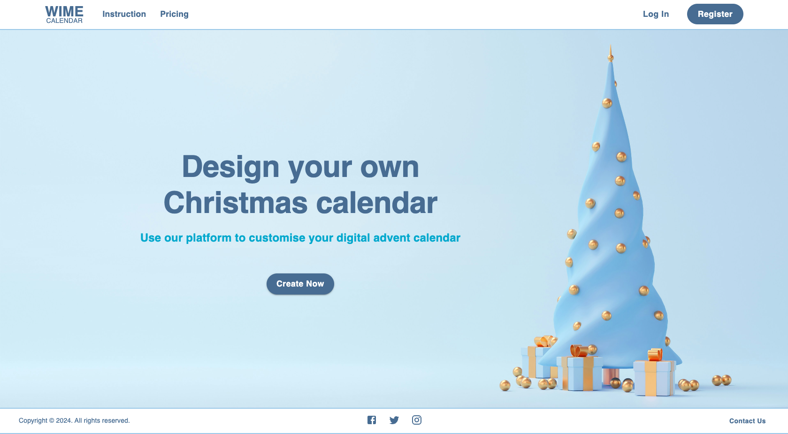
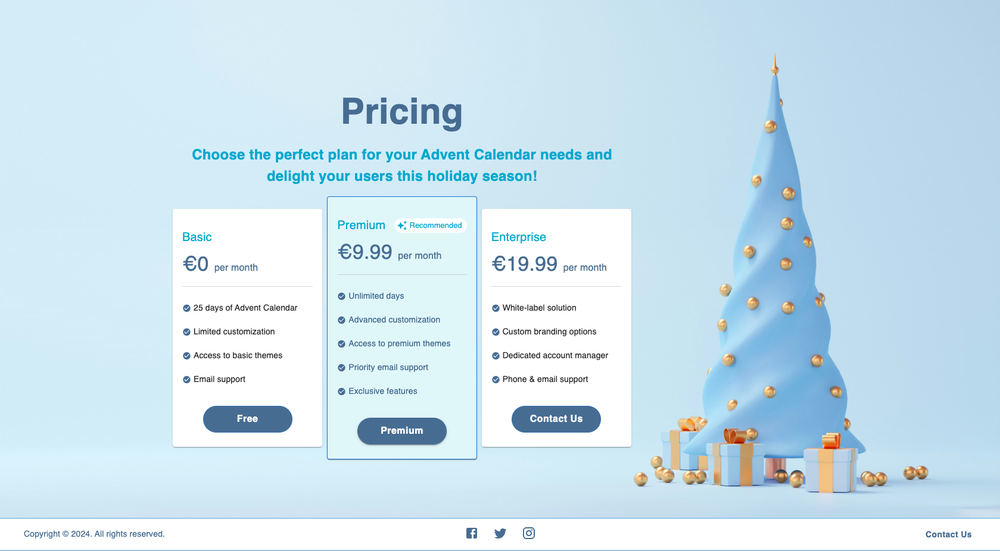
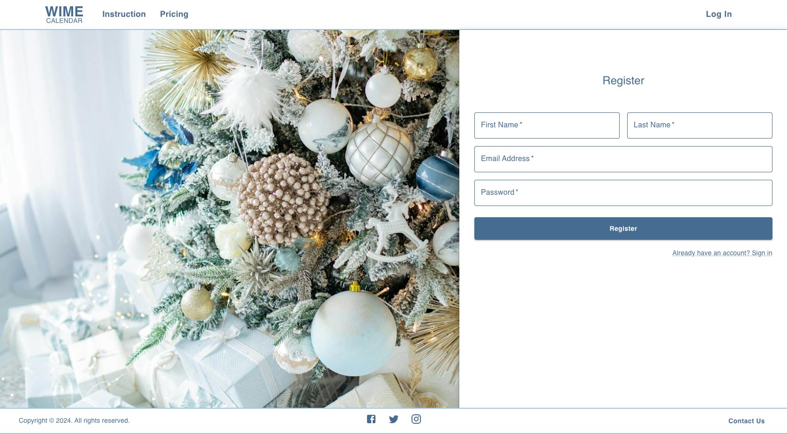
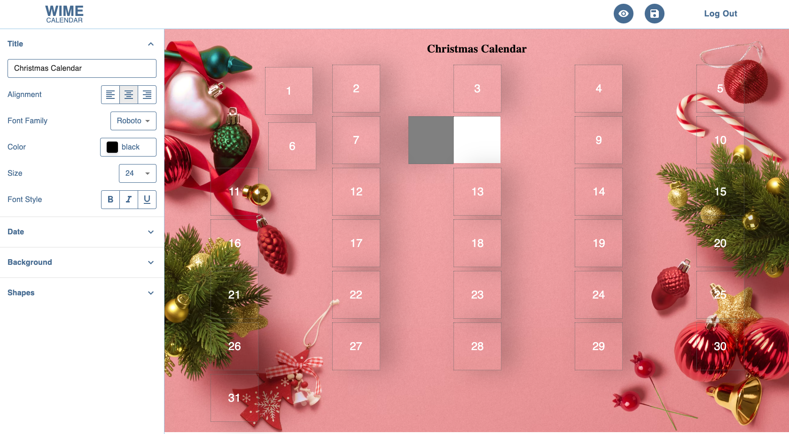
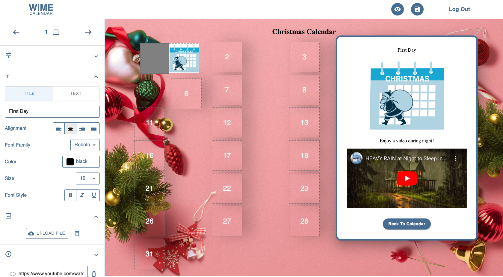

# Advent Calendar Creator

Welcome to the Advent Calendar App! This app is designed to help users countdown to Christmas with daily surprises, activities, or messages leading up to the holiday season.

Using this app, users can customize their digital advent calendar by adding their images, videos and more.

## Technologies used

Built with:

- HTML
- JS
- CSS
- MUI
- Reactjs
- Firebase

## Installation

To run the app locally, follow these steps:

1. Clone this repository.
2. Navigate to the project directory.
3. Install dependencies with `npm install` in client and also in server folder.
4. Start the development server with `npm run dev` in client directory.

## Screenshot

## Authors and acknowledgment

Wen Yan - GitHub @SelinYan
Inna Kozhina - GitHub @Kozhinna
Emmanuel Monle Nyode - GitHub @webAfrique
Md Mohsin - GitHub @mohsinrony
